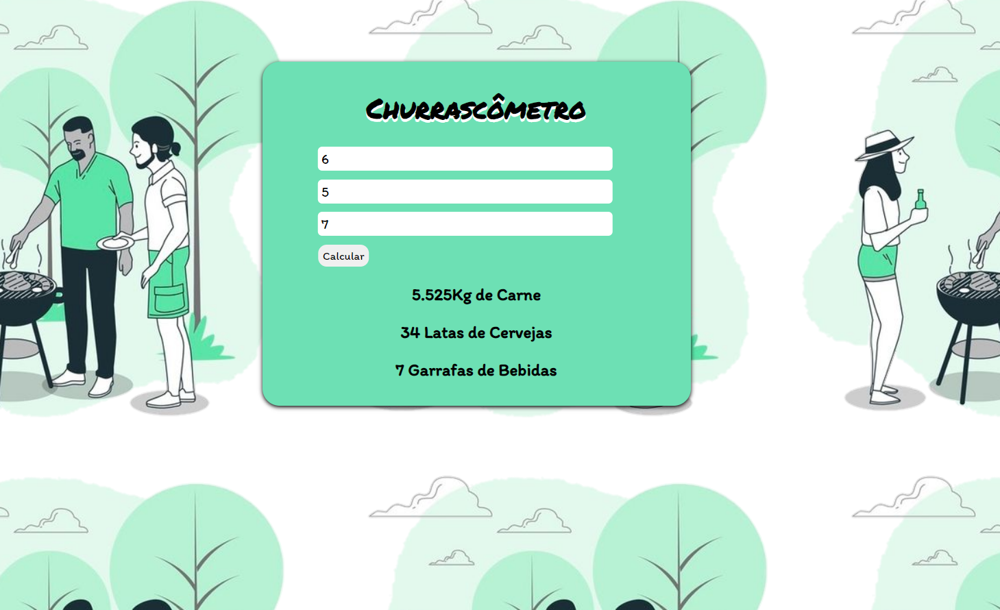

><h1>Churrascômetro</h1>

<h2 align="center">
  Acesse o Churrascômetro Clicando <a target="_blank" href="https://erick-sarges.github.io/Churrascometro/">AQUI</a>!
</h2>

 

  <a href="#clipboard-sobre-o-projeto">Sobre o Projeto</a>&nbsp;&nbsp;&nbsp;|&nbsp;&nbsp;&nbsp;
  <a href="#computer-tecnologias-utilizadas">Tecnologias</a>

## :clipboard: Sobre o Projeto
Sitema para calcular a quantidade de comida e bebida necessária para um churrasco,
com base nas informações seguintes:
Carne - 400gr por pessoa + de 6horas - 650gr
Cerveja - 1200ml por Pessoa + 6 horas - 2000ml
Refrigerante/água - 1000ml por pessoa + 6 horas 1500ml
Crianças valem por 0,5.
## :computer: Tecnologias utilizadas
O projeto foi desenvolvido utilizando as seguintes tecnologias:
- <b>HTML</b>
- <b>CSS</b>
- <b>JAVASCRIPT</b>